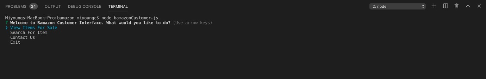

# bamazon
Bamazon is an Amazon-like storefront created using MySQL and Node.js. This app takes in orders from customers and depeletes the stock from the store's inventory. This app is also programmed to track product sales across all departments of the store and also providing a summary of the highest-grossing departments in the store. 

## Getting Started 
### Database Setup
In order to run this application, be sure to have MySQL database downloaded to your computer. Visit the MYSQL INSTALLATION PAGE to install the version needed for your operating system. Once installed, the Bamazon database can be accessed with the SQL code found in file provided. Run the code inside your MySQL to populate databases, then you will be ready to proceed.

After downloading MySQL, a query can be run using the code provided in the mockData.sql file to initialize a mock database to test the functions of this application. 

### Node Package Installation 
This application requires outside packages. To download dependencies, navigate to the root of the application folder from Terminal and enter the command 'npm install'. 
Once the NPM packages for mysql and inquirer have been installed, the application will be ready for use. 

## Interfaces
This application provides three different platforms which aims to track inventory and relevant information of products based on the interface being used to manipulate the database. 

All three interfaces are described as follows: 

### Customer View
To navigate the Bamazon Customer Interface, enter the command 'node bamazonCustomer.js' into terminal from the root of your directory. 

Navigate the menu using up and down arrow keys. 

Selecting the 'View Items For Sale' option will list all products in the inventory available for purchase by their name, price, category, department, and ID Number. 

The application will then prompt you to enter the ID Number of the item to be purchased, followed by the quantity of the item to purchase. When item is successfully added to the cart, the application will prompt you with the notice of the item added to the cart. The application then proceeds based on the user selection from the option menu provided after the item has been added to the cart.

User may continue to add multiple items to their cart until they wish to Checkout. 

Upon Checkout, the application will update the inventory stored in the bamazon database and provide the user with the purchase total. 

Customer service information will be displayed when user selects 'Contact Us' from options menu. 
User may exit the application by selecting 'Exit' from the options menu. User may also exit the application at any time by pressing CTRL + C. 

### Manager View
To navigave the Bamazon Manager Interface, enter the command 'node bamazonManager.js' into terminal from the root of your directory.

The application will list a display of options to the user that can be navigated using the arrow keys. 

The application will list all available products in the inventory for sale when user selects 'View Products For Sale'. 

The application will display all products with a stock quantity below 5 when user selects 'View Low Inventory'. 

User can update existing inventory by entering the unique item ID and then entering the quantity being added to inventory. The console will prompt the user if application is successful in updating the database. 

User can also add new products to the inventory by entering in information that is prompted by the application. The application will prompt the user if the application is successful in updating the database. 

### Supervisor View

Bamazon Supervisor Interface will be available in later versions. 

## Technologies Used 
* JavaScript
* Nodejs

### Code Created and Maintained By 
Miyoung K Chung 

